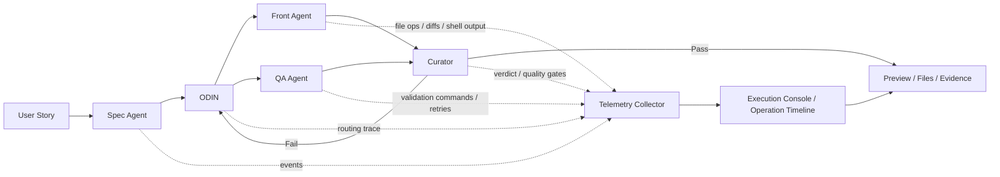

# Horus.AI

Horus.AI is an autonomous multi-agent interface generation system. It receives user stories, transforms them into technical specifications (SDDs), coordinates implementation and quality control agents, validates the generated work through a curator, and exposes the resulting project, preview, files, and execution evidence.

This branch is a reproducibility snapshot of the local Horus workspace. It includes the application source, operational specs, selected runtime data, generated project workspaces, local guidance files, and evidence artifacts needed to inspect the project close to its local machine state.

## Repository Contents

```text
apps/server/      Express API, LangGraph workflow, agents, repositories, preview runtime
apps/web/         React/Vite web application
packages/shared/  Shared Zod schemas and TypeScript contracts
skills/agents/    Runtime skills loaded by the Horus agents
docker/           nginx template for the containerized local web app
scripts/          Operational scripts required by install/build/smoke checks
docs/spec/        Historical and active implementation specifications
spec/             Local implementation specs used during agentic development
data/             Versioned local runtime snapshot and generated project workspaces
.horus/artifacts/ Browser smoke reports and preview evidence images
```

The snapshot still excludes secrets, `.env` files, local package dependencies, build outputs, caches, nested Git repositories, and machine-specific LLM credential stores.

## System Flow



Telemetry is collected during the same agent execution flow, not as a separate after-the-fact report. Each agent emits structured operational events with the current task/session identifiers, touched files, command output, diffs, retries, validation status, failures, and final verdict. The web console projects those events into a navigable execution timeline so the operator can inspect what changed, which commands ran, why a retry happened, and which evidence supported the final preview.

## Requirements

- Node.js 22
- pnpm 9.15.0
- Git
- Docker and Docker Compose for the containerized local stack

The repo includes `.node-version` and `packageManager` metadata. If Corepack can manage pnpm on your machine:

```bash
corepack prepare pnpm@9.15.0 --activate
```

If Corepack cannot create global shims on your machine, install pnpm through your preferred Node package manager:

```bash
npm install -g pnpm@9.15.0
```

## Environment

Create a local environment file:

```bash
cp .env.example .env
```

For the default OpenAI setup, fill only your API key:

```bash
OPENAI_API_KEY=<your-openai-key>
```

`LLM_PROVIDER=openai` is already the default. Horus chooses a provider-specific default model when `LLM_MODEL` is unset. Use the optional provider fields in `.env.example` only if you want OpenRouter or Groq.

Provider examples:

```bash
# OpenAI
LLM_PROVIDER=openai
OPENAI_API_KEY=<your-openai-key>

# OpenRouter
LLM_PROVIDER=openrouter
OPENROUTER_API_KEY=<your-openrouter-key>

# Groq
LLM_PROVIDER=groq
GROQ_API_KEY=<your-groq-key>
```

Set `LLM_MODEL` only when you want to override the provider default.

Never commit `.env`, `.env.*.local`, API keys, LLM credential stores, package dependencies, nested `.git` folders, logs, caches, or build output. Runtime data and generated project workspaces are versioned only when they are part of an explicit reproducibility snapshot.

## Local Development

Install dependencies:

```bash
pnpm install --frozen-lockfile
```

Run the development stack:

```bash
pnpm dev
```

Default local endpoints:

```text
API: http://localhost:3001
Web: http://localhost:5173
```

Health check:

```bash
curl http://localhost:3001/health
```

## Validation

Run the reproducibility gate used by CI:

```bash
pnpm verify:ci
```

That command runs:

```bash
pnpm lint
pnpm type-check
pnpm security:secrets
pnpm build
pnpm verify:llm-providers
```

This public distribution does not include test folders. Internal test suites and specs stay local/private and must not be committed to this repository.

## Production Build Run

Build all shipped packages:

```bash
pnpm build
```

Start the API:

```bash
pnpm --filter @u-build/server start
```

The server entrypoint is:

```text
apps/server/dist/main.js
```

Runtime behavior for local use is intentionally small: choose an LLM provider, set the matching API key, and optionally change `PORT`, `HOST`, `CORS_ORIGIN`, or `HORUS_DATA_DIR`.

By default, Horus uses file persistence under `.horus/data` and does not require a local auth token or database.

## Docker Run

Docker is the clean-machine path for people who want to run the shipped app without managing local Node processes. It builds the source from scratch, starts the API with file persistence, serves the built web app through nginx, and persists Horus state in the `horus-data` Docker volume.

Create the local env file and add your API key:

```bash
cp .env.example .env
```

Run:

```bash
docker compose up --build
```

Default Docker endpoints:

```text
Web UI: http://localhost:8080
API through web proxy: http://localhost:8080/api
Health: http://localhost:8080/health
Ready: http://localhost:8080/ready
Direct API: http://localhost:3001
```

Smoke check:

```bash
pnpm verify:docker
```

Stop the stack:

```bash
docker compose down
```

Reset all local Docker state:

```bash
docker compose down -v
```

## Clean-Machine Reproduction

Use this sequence on a fresh machine:

```bash
git clone https://github.com/Gabriel-Wamat/horus.git
cd horus
corepack prepare pnpm@9.15.0 --activate || npm install -g pnpm@9.15.0
pnpm install --frozen-lockfile
pnpm verify:ci
cp .env.example .env
# edit .env and set OPENAI_API_KEY
docker compose up --build
pnpm verify:docker
```

Expected result:

- dependencies install from `pnpm-lock.yaml`
- TypeScript validation passes
- secret scan passes
- production build passes
- Docker stack becomes healthy
- `pnpm verify:docker` succeeds against `http://localhost:8080`

## Troubleshooting

- Missing provider key: configure `.env` or a provider profile in the UI.
- Port conflict: set `PORT`, `HOST`, or Compose port mappings.
- CORS issue: set `CORS_ORIGIN` only when using split frontend/API origins.
- Lost local state: verify `HORUS_DATA_DIR` or the `horus-data` Docker volume.
- Docker hangs or fails with `input/output error`: inspect Docker Desktop logs for `EXT4-fs` or `vda1` read-only errors. That is a local Docker VM disk problem. Restart Docker Desktop first; if it remains read-only, repair or reset Docker Desktop data before rerunning the stack.

## License

This project is not licensed for commercial use.

Horus.AI is distributed under the Horus.AI Restricted Non-Commercial License in `LICENSE`.
