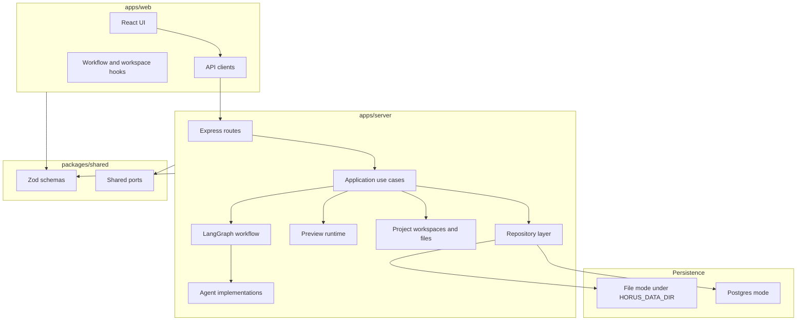
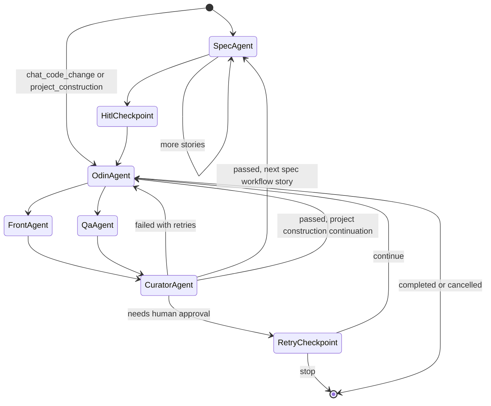
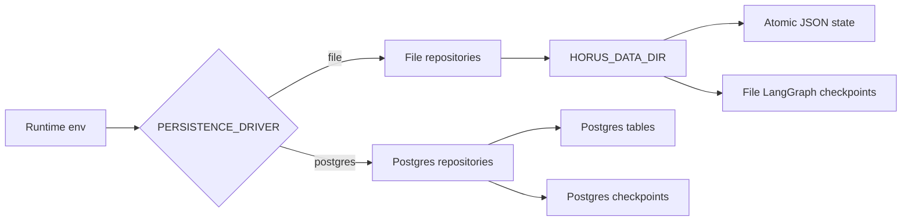

# Architecture

Horus.AI is organized as a monorepo with three primary runtime boundaries:

- `apps/server`: Express API, LangGraph workflow, agent implementations, persistence repositories, preview runtime, project construction, and file operations.
- `apps/web`: React/Vite interface for user stories, specs, agent flow, previews, chat, LLM settings, and project files.
- `packages/shared`: Zod schemas, entities, and ports shared by server and web.

The system centers on an agentic workflow: a user story becomes a specification, ODIN routes implementation and QA work, the Curator validates the outcome, and the orchestrator either retries, escalates, or completes.

## Visual Overview

## Backend Layers

`apps/server/src` follows a layered shape:

- `domain`: core services and ports that model workflow behavior.
- `application`: use cases, run-flow mapping, agent tool registry, validation aggregation, and code context services.
- `infrastructure`: adapters for HTTP, LangGraph, agents, persistence, preview runtime, LLM providers, project workspaces, file browsing, and command execution.

Key entrypoints:

- `apps/server/src/main.ts`: process entrypoint. Loads env, creates the app, and binds `PORT`/`HOST`.
- `apps/server/src/infrastructure/http/server.ts`: wires repositories, event streams, preview runtime, LLM settings, LangGraph checkpointer, use cases, and routes.
- `apps/server/src/infrastructure/langgraph/graph.ts`: defines the workflow graph and routing edges.

## HTTP Surface

The Express app mounts these route groups:

- `/api/llm`: provider/settings APIs.
- `/api/workflow`: start, resume, status, and retry decision APIs.
- `/api/workspace`: workspace folders, user stories, and specs.
- `/api/chat`: chat sessions and messages.
- `/api/horus`: Horus chat turn endpoints, including streaming.
- `/api/preview`: preview projects, sessions, timeline, devices, and visual instruction drafts.
- `/api/agent-runs`: run-flow snapshots and event streams.
- `/api/project-construction`: generated project construction runs.
- `/api/project-files`: safe project file tree/read/write APIs.
- `/api/events`: workflow event stream.
- `/health`: non-secret process health check.

## LangGraph Workflow

The graph in `apps/server/src/infrastructure/langgraph/graph.ts` uses these nodes:

1. `specAgent`
2. `hitlCheckpoint`
3. `odinAgent`
4. `frontAgent`
5. `qaAgent`
6. `curatorAgent`
7. `retryCheckpoint`

Routing rules:

- `START` routes to `specAgent` for spec-generation workflows.
- Chat code-change and project-construction workflows can route directly to `odinAgent`.
- `odinAgent` fans out to `frontAgent`, `qaAgent`, or both.
- `frontAgent` and `qaAgent` fan in to `curatorAgent`.
- `curatorAgent` either advances, retries through ODIN, or escalates to `retryCheckpoint`.
- `retryCheckpoint` lets a human continue or stop.

The workflow is compiled with a configurable LangGraph checkpointer. File mode uses a file-backed checkpointer under `HORUS_DATA_DIR`; Postgres mode uses the Postgres checkpointer.

## Agent Responsibilities

Project-local runtime skills live in `skills/agents`.

- Spec Agent: turns user stories into technical specifications.
- ODIN Agent: routes work and decides which specialists should run.
- Front Agent: proposes frontend code changes.
- QA Agent: produces test and validation expectations.
- Curator Agent: compares spec, proposed code, QA evidence, runtime evidence, and quality gates.

Agents are expected to operate from real project context, not invented architecture. The tool and validation layers exist to keep generated changes auditable.

## Persistence

Persistence is selected by `PERSISTENCE_DRIVER`.

File mode:

- Uses JSON repositories under `HORUS_DATA_DIR`.
- Stores workflow state, workspaces, chat memory, preview sessions, frontend projects, code change sets, workflow events, project construction metadata, generated project workspaces, and file-backed LangGraph checkpoints.
- Uses atomic JSON writes for internal state files.

Postgres mode:

- Uses `DATABASE_URL`.
- Runs migrations during repository creation.
- Stores workflow, workspace, chat, preview, code-change, event, and project-construction records in Postgres-backed repositories.
- Uses Postgres-backed LangGraph checkpoints.

The repository factory is `apps/server/src/infrastructure/repositories/createRepositories.ts`.

## Frontend Architecture

`apps/web/src/App.tsx` composes the main application shell and delegates state-heavy behavior to hooks:

- `useAppNavigation`
- `useWorkspaceFolders`
- `useWorkflowRuntime`
- `useDisplayedWorkflowState`
- `useProjectConstructionAction`

Major UI surfaces:

- User story/spec workspace
- Workflow progress
- Agent flow map
- Visual preview console
- Preview chat panel
- Project files editor
- LLM settings modal

API modules live under `apps/web/src/api`. Shared types come from `@u-build/shared`.

## Shared Contracts

`packages/shared/src` defines the typed contract between backend, frontend, tests, and agent workflow:

- `UserStory`
- `Spec`
- `WorkflowState`
- `AgentResult`
- `CodeChangeSet`
- `Preview`
- `HorusRunFlow`
- `HorusChat`
- `ProjectConstruction`
- `ProjectFiles`
- `LlmSettings`
- `Workspace`

The project relies on Zod schemas for runtime validation and TypeScript inference.

## Preview Runtime

Preview runtime is managed by `PreviewRuntimeManager` and `ProcessBrowserPreviewAdapter`.

Responsibilities:

- Register previewable frontend projects.
- Create/start/stop/reload preview sessions.
- Capture bounded runtime evidence.
- Persist preview timelines and visual instruction drafts.
- Recover stale runtime sessions after process restarts.

Preview commands must pass through command catalog and safety validation. They are not arbitrary shell execution.

## Project Construction and Files

Project construction creates git-backed generated project workspaces under configured roots. The project file browser exposes safe read/write operations against selected project workspaces.

Important services:

- `ProjectWorkspaceService`
- `ProjectExecutionService`
- `ProjectManifestService`
- `ProjectConfigService`
- `ProjectFileBrowserService`
- `ProjectCodeChangeSetApplier`
- `ProjectQualityGateService`

Path safety is enforced by project-root and write-root checks.

## Critical Invariants

- Do not persist raw provider secrets in frontend state, logs, events, or workflow snapshots.
- Do not write generated state outside configured persistence/workspace roots.
- Do not apply Front Agent changes before Curator approval.
- Do not mark workflow success unless required validation gates have passed or are explicitly recorded as unverified/skipped.
- Do not let agents bypass project file, command, or write-root policies.
- Do not hardcode machine-specific paths.
