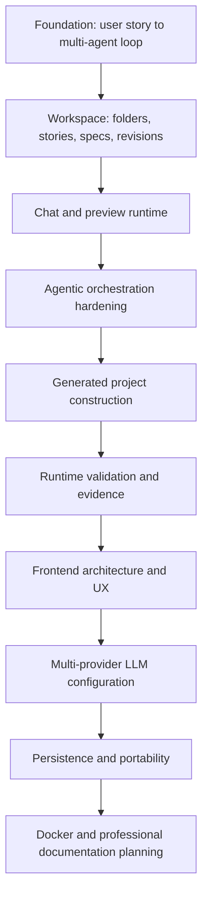

# Chronology

This chronology summarizes the engineering evolution of Horus.AI from the local specification history and the current codebase. It focuses on architecture milestones, not every individual commit.

## Timeline View

## Milestone Matrix

| Phase | Main Shift | Result |
| --- | --- | --- |
| Foundation | Prompt pipeline to LangGraph workflow | Repeatable agent routing |
| Workspace | Ephemeral input to persisted artifacts | Versioned stories and specs |
| Chat/Preview | Static outputs to interactive runtime | Preview sessions and chat actions |
| Orchestration | Agent output to curated changes | Approval before apply |
| Project Construction | Single app focus to generated workspaces | Safe project file workflows |
| Evidence | Trust by prose to trust by runtime data | Gates, events, smoke checks |
| Frontend | Dense app shell to operational surfaces | Agent Flow, Project Files, Preview Console |
| LLM Settings | Env-only to configurable providers | OpenAI/OpenRouter/Groq paths |
| Portability | Local defaults to explicit runtime config | `HORUS_DATA_DIR`, Postgres, file checkpoints |
| Docs/Ops | Tribal context to navigable docs | README, docs, runbooks, Docker plan |

## Foundation

The project starts from an autonomous user-story-to-implementation loop:

1. A user provides a story.
2. A Spec Agent generates a technical specification.
3. ODIN routes implementation and QA work.
4. Front and QA agents run in parallel.
5. The Curator validates generated output against the spec.
6. ODIN retries, escalates, or finishes.

This foundation is implemented through LangGraph and the shared workflow state contracts.

## Workspace and Artifact Evolution

Early architecture work introduced workspace folders, persisted user stories, specs, artifact context, and revision metadata. This moved Horus away from one-off prompt execution toward durable project workspaces.

Important outcomes:

- User stories can be stored in named workspace folders.
- Specs are versioned per story.
- Workflow starts consume persisted story/spec context.
- Chat and agent context can reference active artifact revisions.

## Chat and Preview Runtime

The system then expanded into chat-driven change requests and visual preview workflows.

Important outcomes:

- Chat sessions persist messages and context snapshots.
- Horus chat routes can classify intent and delegate to spec generation, preview actions, or code-change orchestration.
- Preview sessions track status, devices, runtime evidence, visual instruction drafts, and timeline events.
- Preview runtime can start managed processes and recover stale sessions after restart.

## Agentic Orchestration Hardening

The workflow was hardened so agent outputs are not treated as success by default.

Important outcomes:

- Code changes are represented as auditable `CodeChangeSet` records.
- Front Agent output is proposed before approval.
- Curator approval is required before applying changes.
- Rejected changes are blocked.
- Retry and human-in-the-loop checkpoint behavior is explicit.
- Agent run-flow snapshots expose phases, nodes, evidence, files, tools, and validation gates.

## Generated Project Construction

Horus added project construction workflows that create git-backed project workspaces and expose safe file operations.

Important outcomes:

- Generated projects receive Horus project manifests and local config files.
- Project files can be listed, read, and saved through bounded APIs.
- Writes are protected by path safety, version checks, secret filtering, binary detection, and write-root policy.
- Project execution uses command catalogs instead of arbitrary shell access.

## Runtime Validation and Evidence

The project added validation evidence as a first-class concept.

Important outcomes:

- QA preview smoke validation records runtime evidence.
- Curator prechecks can block approval when runtime evidence fails.
- Quality gates expose command evidence and skipped/unverified states.
- Completion semantics distinguish success, failure, blocked, skipped, and unverified checks.

## Frontend Architecture and UX

The frontend evolved from a dense single surface into more structured operational views.

Important outcomes:

- App state was separated into navigation, workspace, workflow runtime, and project construction hooks.
- Agent Flow provides run visualization and evidence inspection.
- Project Files gained an IDE-like editing workflow.
- Preview Chat streams user and assistant messages with action lifecycle feedback.
- LLM settings are managed through a dedicated modal and backend settings routes.

## Multi-Provider LLM Configuration

The system introduced provider/model configuration for multiple LLM providers.

Important outcomes:

- OpenAI, OpenRouter, and Groq are supported through backend provider configuration.
- Runtime settings can resolve from request/session settings, persisted profiles, per-agent env overrides, or global env defaults.
- Frontend settings avoid storing raw keys as ordinary application state after persistence.
- Provider settings APIs expose redacted profile information.

## Persistence and Portability

The persistence layer moved from scattered local defaults toward explicit runtime configuration.

Important outcomes:

- `PERSISTENCE_DRIVER=file` stores data under `HORUS_DATA_DIR`.
- `PERSISTENCE_DRIVER=postgres` uses Postgres repositories.
- File-mode JSON stores use atomic writes.
- File-mode LangGraph checkpoints persist under the data directory.
- Runtime logs disclose driver and data directory without exposing secrets.
- Machine-specific paths were removed from runtime agent skills.

## Docker and Documentation Planning

The latest planning work defines two operational hardening tracks:

- Portable Docker runtime: a future Docker/Compose setup for file-mode and Postgres-mode execution across macOS, Windows, and Linux.
- Professional documentation: this documentation package, root README, architecture docs, runbook, configuration reference, chronology, and contributing guide.

Docker should not be presented as the supported primary path until Docker artifacts exist and have been validated.

## Current State

Current supported path:

- pnpm workspace development.
- File-mode local persistence.
- Optional Postgres persistence.
- React/Vite web UI.
- Express/LangGraph backend.
- Shared Zod contracts.

Current caution areas:

- Docker is planned, not yet implemented.
- Generated project preview behavior depends on command catalog and local port availability.
- File-mode data is local runtime state and must not be committed.
- Local specs under `spec/` are implementation planning artifacts and are intentionally ignored.

## Future Work

Near-term professionalization work:

- Implement Docker runtime artifacts and validate them.
- Keep README and docs aligned with Docker once it lands.
- Add automated documentation link checks if docs continue to grow.
- Continue tightening generated project preview behavior in containerized environments.
