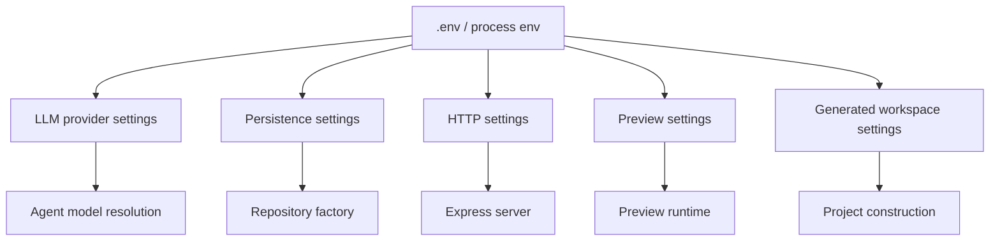

# Configuration

Horus.AI is configured through environment variables. Copy `.env.example` to `.env` for local development.

```bash
cp .env.example .env
```

Never commit `.env`, `.horus/`, `data/`, or generated local state.

## Configuration Map



## Required Vs Optional

| Area | Required For Build | Required For Real Agent Run | Notes |
| --- | --- | --- | --- |
| Node/pnpm | Yes | Yes | Declared in `package.json` |
| Provider key | No | Yes | Needed when an LLM call is invoked |
| File persistence | Default | Default | Uses `.horus/data` unless overridden |
| Postgres | No | Only in Postgres mode | Requires `DATABASE_URL` |
| Preview vars | No | For custom preview behavior | Defaults exist for local web project |

## LLM Provider Variables

| Variable | Required | Secret | Description |
| --- | --- | --- | --- |
| `LLM_PROVIDER` | Yes for LLM workflows | No | Global provider. Supported values are currently `openai`, `openrouter`, and `groq`. |
| `LLM_MODEL` | Yes for LLM workflows | No | Global model name. |
| `OPENAI_API_KEY` | When using OpenAI | Yes | OpenAI API key. |
| `OPENROUTER_API_KEY` | When using OpenRouter | Yes | OpenRouter API key. |
| `GROQ_API_KEY` | When using Groq | Yes | Groq API key. |
| `OPENAI_BASE_URL` | No | No | Override for OpenAI-compatible endpoint. |
| `OPENROUTER_BASE_URL` | No | No | Override for OpenRouter endpoint. |
| `GROQ_BASE_URL` | No | No | Override for Groq OpenAI-compatible endpoint. |

Default provider base URLs are declared in `.env.example` and resolved by backend LLM configuration code.

## Per-Agent Provider Overrides

| Variable | Required | Secret | Description |
| --- | --- | --- | --- |
| `SPEC_AGENT_PROVIDER` | No | No | Provider override for Spec Agent. |
| `SPEC_AGENT_MODEL` | No | No | Model override for Spec Agent. |
| `FRONT_AGENT_PROVIDER` | No | No | Provider override for Front Agent. |
| `FRONT_AGENT_MODEL` | No | No | Model override for Front Agent. |
| `QA_AGENT_PROVIDER` | No | No | Provider override for QA Agent. |
| `QA_AGENT_MODEL` | No | No | Model override for QA Agent. |
| `CURATOR_AGENT_PROVIDER` | No | No | Provider override for Curator Agent. |
| `CURATOR_AGENT_MODEL` | No | No | Model override for Curator Agent. |

Optional tuning:

| Variable | Required | Secret | Description |
| --- | --- | --- | --- |
| `FRONT_AGENT_TEMPERATURE` | No | No | Temperature override for Front Agent. |
| `FRONT_AGENT_MAX_TOKENS` | No | No | Max token override for Front Agent. |
| `QA_AGENT_TEMPERATURE` | No | No | Temperature override for QA Agent. |
| `CURATOR_AGENT_TEMPERATURE` | No | No | Temperature override for Curator Agent. |

## Persistence Variables

| Variable | Required | Secret | Description |
| --- | --- | --- | --- |
| `PERSISTENCE_DRIVER` | No | No | `file` or `postgres`. Defaults to `file`. |
| `HORUS_DATA_DIR` | No | No | Base directory for file-mode state. Defaults to `.horus/data`. |
| `DATABASE_URL` | When `PERSISTENCE_DRIVER=postgres` | Yes | Postgres connection URL. |
| `DATABASE_SSL` | No | No | Set to `true` when the database requires SSL. |

File mode stores local state under `HORUS_DATA_DIR`, including workflow state, chat memory, preview sessions, project construction metadata, LLM profile data, and LangGraph file checkpoints.

Postgres mode uses database repositories and runs migrations at startup through the repository factory.

## HTTP Variables

| Variable | Required | Secret | Description |
| --- | --- | --- | --- |
| `PORT` | No | No | Server port. Defaults to `3000`. |
| `HOST` | No | No | Bind host. Use `0.0.0.0` for containerized or network-visible operation. |
| `CORS_ORIGIN` | No | No | Empty or `*` allows local development. Comma-separated origins restrict access. |

Health endpoint:

```text
GET /health
```

## Preview Project Seed Variables

These values configure the default frontend project registry seed. They are environment-driven to avoid machine-specific paths.

| Variable | Required | Secret | Description |
| --- | --- | --- | --- |
| `HORUS_WEB_PROJECT_ROOT` | No | No | Project root for the default web project. Usually `apps/web`. |
| `HORUS_WEB_PROJECT_NAME` | No | No | Display name for the default web project. |
| `HORUS_WEB_PROJECT_SLUG` | No | No | Stable slug for the default web project. |
| `HORUS_WEB_DEFAULT_ROUTE` | No | No | Default preview route. |
| `HORUS_PACKAGE_MANAGER` | No | No | Package manager used in preview command catalog. |
| `HORUS_WEB_PACKAGE_FILTER` | No | No | pnpm filter for the web package. |
| `HORUS_WEB_PREVIEW_HOST` | No | No | Preview host. |
| `HORUS_WEB_PREVIEW_PORT` | No | No | Preview port. |
| `HORUS_WEB_PREVIEW_URL` | No | No | Browser-facing preview URL. |

## Generated Project Workspace Variables

| Variable | Required | Secret | Description |
| --- | --- | --- | --- |
| `HORUS_PROJECT_WORKSPACE_ROOT` | No | No | Root for generated project workspaces. Defaults under `HORUS_DATA_DIR`. |
| `HORUS_PROJECT_RUN_WORKSPACE_ROOT` | No | No | Root for run worktrees. Defaults under `HORUS_DATA_DIR`. |
| `HORUS_GENERATED_PROJECT_PREVIEW_HOST` | No | No | Host used for generated project preview runs. |
| `HORUS_GENERATED_PROJECT_PREVIEW_PORT` | No | No | Port used for generated project preview runs. |

## Secret Handling Rules

- Do not commit provider keys.
- Do not place real secrets in `.env.example`.
- Do not copy `.env` into Docker images.
- Do not store raw provider keys in frontend state, workflow snapshots, event logs, or generated artifacts.
- File-mode LLM credential state belongs under `HORUS_DATA_DIR` and must stay ignored.

## Portable Path Rules

- Relative paths resolve from the repository root where runtime config supports it.
- Do not use machine-specific paths in committed config.
- Prefer `HORUS_DATA_DIR` and generated workspace variables for local state.
- Do not point generated project roots into source directories unless intentionally developing that behavior.
