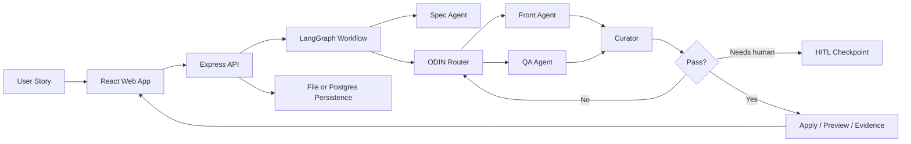
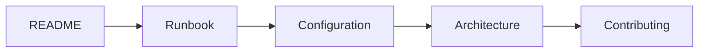
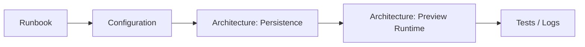
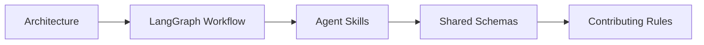

# Horus.AI Documentation

This is the visual entrypoint for understanding, running, and maintaining Horus.AI.

## Quick Map

| Need | Start Here | Outcome |
| --- | --- | --- |
| Understand the product | [README](../README.md) | High-level overview and first-run commands |
| Understand the system | [Architecture](architecture.md) | Backend, frontend, agents, persistence, and data flow |
| Run or troubleshoot | [Runbook](runbook.md) | Local startup, validation, reset, and failure recovery |
| Configure runtime | [Configuration](configuration.md) | Env vars, secrets, persistence, providers, preview |
| Understand project history | [Chronology](chronology.md) | Engineering timeline and major milestones |
| Contribute safely | [Contributing](contributing.md) | Boundaries, rules, tests, and Git hygiene |

## System At A Glance



## Runtime Surfaces

| Surface | Path | Responsibility |
| --- | --- | --- |
| Web app | `apps/web` | User stories, specs, previews, chat, project files, run-flow UI |
| API server | `apps/server` | Routes, orchestration, agents, persistence, preview runtime |
| Shared contracts | `packages/shared` | Zod schemas and shared types |
| Agent skills | `skills/agents` | Runtime instructions consumed by product agents |
| Local specs | `spec` | Local-only planning specs, not published |

## Core Commands

```bash
pnpm install
pnpm dev
pnpm build
pnpm test
```

## Data And Secrets

| Must Commit | Must Not Commit |
| --- | --- |
| `README.md` | `.env` |
| `docs/*.md` | `.horus/` |
| `packages/shared/src/**` | `data/` |
| `apps/server/src/**` | `apps/server/.env` |
| `apps/web/src/**` | `apps/server/data/` |
| `skills/agents/**` | `spec/` |
| `.env.example` | `output/` |

## Reading Paths

### New Contributor



### Runtime Debugging



### Agent Workflow Work


